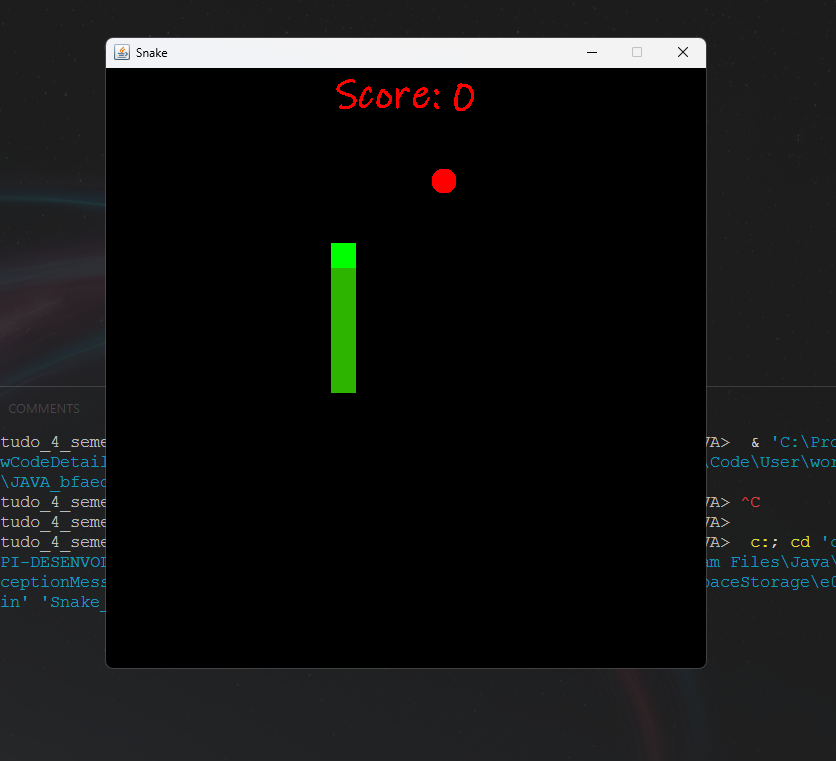

# 🐍 Snake Game em Java

Um clássico jogo da cobrinha (Snake) recriado em **Java puro**, com interface gráfica baseada em `Swing` e lógica de movimentação e colisão programada do zero.

Este projeto demonstra domínio de conceitos fundamentais como **eventos de teclado**, **sistemas de renderização com `Graphics`**, **detecção de colisão**, e **geração aleatória de objetos no jogo**.

<p align="center">
  
</p>

---

## 🚀 Funcionalidades

- 🎮 Controle por teclado com fluidez (setas direcionais)
- 🍎 Geração de maçãs aleatórias para aumentar o corpo da cobra
- ☠️ Condição de Game Over ao colidir com o próprio corpo
- 🧱 Atualização constante do jogo com `Timer`
- 🧩 Arquitetura modular com classes separadas

---

## 🧠 Habilidades Utilizadas

✅ **Programação Orientada a Objetos (POO)**  
✅ **Manipulação de interface gráfica com Java Swing**  
✅ **Eventos de teclado com `KeyAdapter`**  
✅ **Sistema de animação com `Timer` e `repaint()`**  
✅ **Gerenciamento de estado e colisão em tempo real**  
✅ **Renderização com `Graphics` e `FontMetrics`**  
✅ **Códigos organizados em classes modulares**

---

## 🗂️ Estrutura dos Arquivos

```
Snake_Game_JAVA/
├── GameFrame.java      # Janela principal do jogo
├── GamePanel.java      # Lógica completa do jogo (movimento, colisão, desenho)
├── SnakeGame.java      # Classe com o método main()
```

---

## 🕹️ Controles

- **Movimentação da cobra:**  
  `↑` `↓` `←` `→` (setas do teclado)

---

## 📦 Como Rodar

1. Clone este repositório:

```bash
git clone https://github.com/Gengo250/Snake_Game_JAVA.git
```

2. Compile e execute com:

```bash
javac *.java
java SnakeGame
```

---

## 🖼️ Prévia do Jogo

<p align="center">
  
</p>

---

## 📚 Aprendizados

Durante o desenvolvimento deste jogo foram reforçados conhecimentos como:

- Manipulação de gráficos e fontes
- Detecção de colisão simples
- Lógica de jogo baseada em matriz
- Controle de fluxo com timers
- Separação de responsabilidades em componentes

---


## 🧑‍💻 Autor

**Miguel de Castilho Gengo**  
🎓 Estudante de Engenharia da Computação - PUC Campinas

---

## ⭐ Licença

Distribuído sob a licença MIT. Veja o arquivo `LICENSE` para mais detalhes.

---

> Feito com lógica, curiosidade e muito Java 💻🐍
